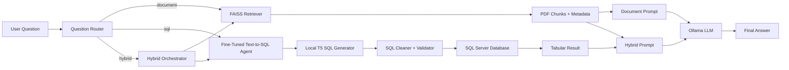
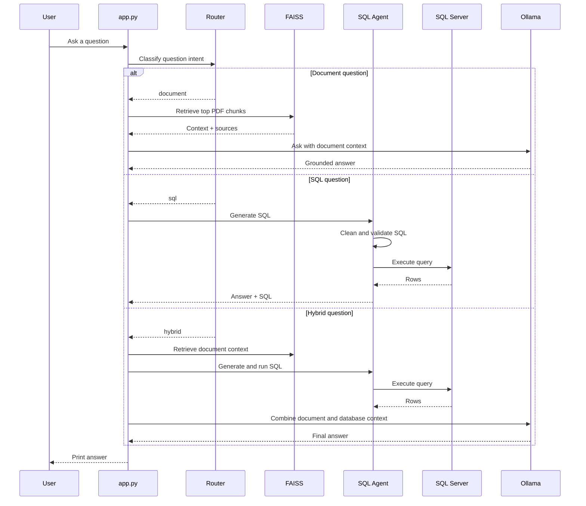
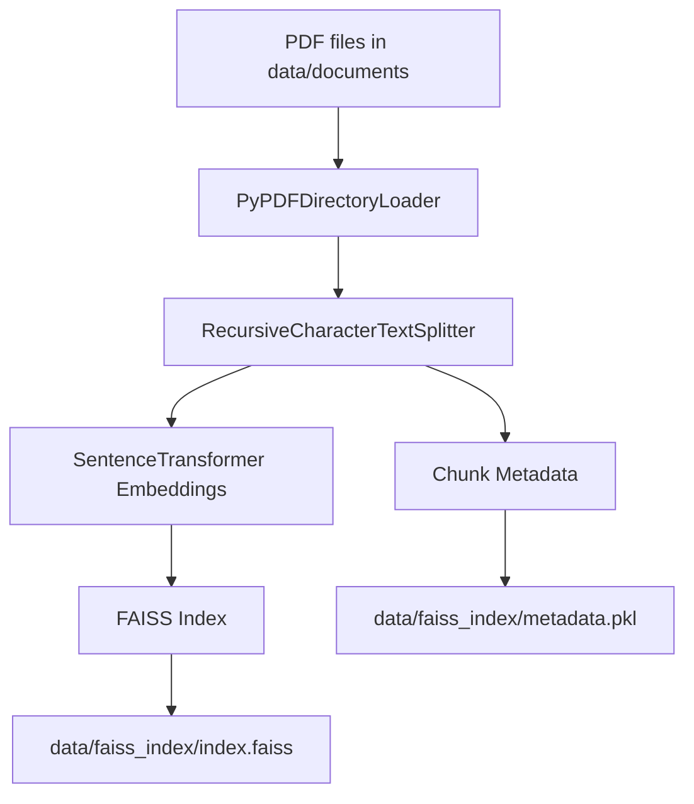

# Hybrid RAG + Fine-Tuned Text-to-SQL Assistant

A local AI assistant that answers questions from both PDF documents and a SQL Server database. The project combines document retrieval, a fine-tuned Text-to-SQL model, SQL validation, and an Ollama-powered response layer to support document, database, and hybrid questions from one command-line interface.

## Highlights

- Routes each question to the right path: document RAG, SQL, or hybrid.
- Retrieves PDF context from a FAISS vector index built with `BAAI/bge-small-en-v1.5` embeddings.
- Uses a fine-tuned local T5-style model to translate natural language into SQL.
- Validates generated SQL before execution to block dangerous statements.
- Executes database queries through SQL Server using `pyodbc`.
- Uses Ollama with `llama3` to generate final natural-language answers.
- Returns document sources with page numbers for document-based answers.

## Architecture



## Runtime Flow



## Data Pipeline



## Project Structure

```text
.
├── app.py                  # CLI entry point and orchestration
├── config.py               # Model, database, and retrieval settings
├── core/
│   ├── llm.py              # Ollama LLM loader
│   ├── prompts.py          # Document and hybrid prompts
│   └── router.py           # Question routing logic
├── rag/
│   ├── ingest.py           # PDF ingestion and FAISS index builder
│   ├── embeddings.py       # SentenceTransformer embedding model
│   ├── retriever.py        # Query-time vector retrieval
│   └── vector_store.py     # FAISS persistence wrapper
├── sql/
│   ├── db.py               # SQL Server connection
│   ├── schema.py           # Database schema reference
│   ├── sql_agent.py        # Fine-tuned Text-to-SQL inference and execution
│   └── validator.py        # SQL cleanup and safety checks
├── data/
│   ├── documents/          # Source PDFs
│   └── faiss_index/        # Persisted vector index
└── models/                 # Fine-tuned local Text-to-SQL model
```

## Requirements

- Python 3.11 or newer
- SQL Server with ODBC Driver 17
- Ollama installed locally
- `llama3` available in Ollama
- A fine-tuned model saved in `models/`
- PDF files in `data/documents/`

Install Python dependencies:

```bash
pip install -r requirements.txt
```

Pull the Ollama model if needed:

```bash
ollama pull llama3
```

## Configuration

Update [config.py](config.py) for your local environment:

```python
EMBEDDING_MODEL = "BAAI/bge-small-en-v1.5"
LLM_MODEL = "llama3"
TOP_K = 3
MAX_SQL_ROWS = 20
CONNECTION_STRING = "..."
```

The current database connection targets a local SQL Server database named `university`.

## Build The Document Index

Add PDFs to `data/documents/`, then build the FAISS index:

```bash
python rag/ingest.py
```

This creates:

```text
data/faiss_index/index.faiss
data/faiss_index/metadata.pkl
```

## Run The Assistant

```bash
python app.py
```

Example prompts:

```text
What are the rules in the Monopoly document?
Show the students enrolled in computer science.
Compare the document rules with the database course information.
```

## SQL Safety

Generated SQL is cleaned and checked before execution. The validator blocks high-risk commands such as:

```text
DROP, ALTER, TRUNCATE, EXEC, EXECUTE, CREATE
```

`UPDATE` and `DELETE` statements are also blocked unless they include a `WHERE` clause.

